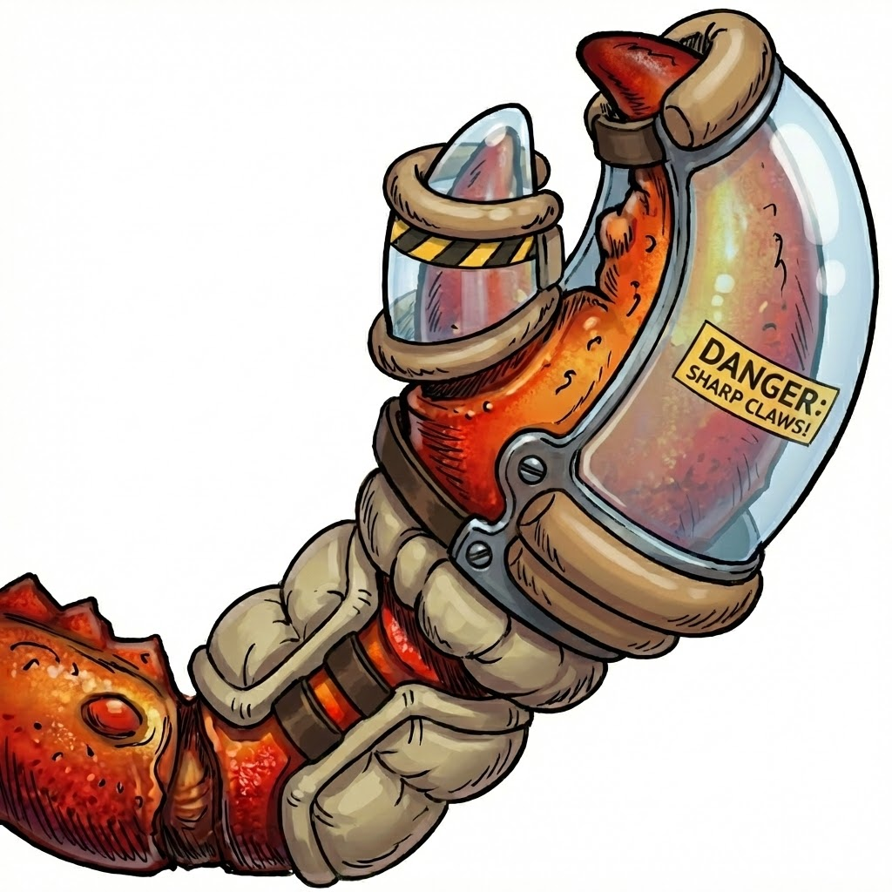

# 🛡️ Claw Sheath — AI Agent Protection

<p align="center">
  
</p>

<p align="center">
  <b>PROTECT YOUR AGENT FROM ACCIDENTS</b>
</p>

<p align="center">
  
  
  
  
</p>

**Put a sheath on your AI agents to prevent them from accidentally destroying your local or remote systems.**

### Supported AI Clients
- [x] **OpenClaw**
- [x] **Claude Code**
- [x] **Cursor**
- [x] **Antigravity**

Claw Sheath adds an extra protection layer to let you run fully autonomous coding and personal agents. When an agent hallucinates and tries to execute dangerous operations, it will be asked to think deeply and justify its actions.

You can enable strict mode, which allows an LLM judge to evaluate the justification and decide whether to allow or deny the action.

It's very simple and naive - a dynamic proxy for your shell. It provides initial feedback that can help the agent correct itself and try again. An agent can absolutely bypass it, so it's not a sandbox or a military-grade isolation environment. It's just a simple, lightweight protection layer that helps prevent accidental damage.

## Installation

```bash
curl -fsSL https://raw.githubusercontent.com/antonibertel/claw-sheath/main/install.sh | bash
```

To use Claw Sheath, you must configure your AI coding agent/tool to use the `src/cs` wrapper (or inject `src/sheath-env.sh`) as its primary shell environment. 

### Usage

**OpenClaw & Claude Code**

If you followed the installation instructions to add `~/.claw-sheath/src` to your PATH, you can just use the provided `cs` convenience wrapper:

```bash
cs openclaw agent --agent main --message "Run rm important.txt"
# OR
cs claude
```

**Antigravity**

```bash
cs open -a "Antigravity"
```

Cursor
TODO

## Covered Disruptive Commands requiring justification

**Destructive file/data operations (Deletion & Wiping):**
- `rm` (File/directory removal)
- `mv` (Moving/overwriting)
- `wipe` (Secure deletion)
- `shred` (Secure deletion)
- `truncate` (File shrinking/wiping)
- `dd` (Low-level block copying/overwriting)

**Disk and Volume modification:**
- `mkfs` (Formatting file systems)
- `fdisk` (Partitioning)
- `mkswap` (Swap creation)

**Process & System Disruption:**
- `kill` (Terminating processes)
- `killall` (Terminating all instances)
- `pkill` (Terminating by name)
- `sudo fdesetup disable` (Disabling FileVault encryption)
- `sudo nvram -c` (Clearing NVRAM variables)
- `kubectl delete` (Kubernetes resource deletion)
